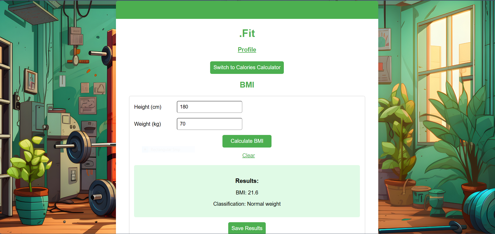

# .Fit
This a fitness project featuring two calculators used frequently in the realm of fitness. Most of the athlets and people who follow a rotten with or just a diet use these two more than once in a year to track there progress. In this project i am offering an easy what to do it with calm and user friendly UI
- What does it do?<br>This is a project to calculate BMI and calories intake 
- What is the "new feature" which you have implemented that
we haven't seen before? <br>Calculating the BMI (Body Mass Index) <br>Calculating Calories intake <br>Saving the calculation in a the user's history and represent it with a date to help him track his progress 


## Prerequisites
Did you add any additional modules that someone needs to
install (for instance anything in Python that you `pip
install-ed`)?
- Flask Version: 2.3.1
- Python Version: 3.11.9
- Werkzeug Version: 2.3.2
## Project Checklist
- [x] It is available on GitHub.
- [x] It uses the Flask web framework.
- [x] It uses at least one module from the Python Standard
Library other than the random module.
Please provide the name of the module you are using in your
app.
- Module name: datetime,Blueprint,render_template,session,redirect,request,jsonify,werkzeug,generate_password_hash,check_password_hash
- [x] It contains at least one class written by you that has
both properties and methods. It uses `__init__()` to let the
class initialize the object's attributes (note that
`__init__()` doesn't count as a method). This includes
instantiating the class and using the methods in your app.
Please provide below the file name and the line number(s) of
at least one example of a class definition in your code as
well as the names of two properties and two methods.
- File name for the class definition: app.py
- Line number(s) for the class definition: 13
- Name of two properties:  self.activity_constants,self.default_activity_level
- Name of two methods: calculate_bmr,calculate_tdee
- File name and line numbers where the methods are used: name: app.py lines: 85,88,91
- [x] It makes use of JavaScript in the front end and uses the
localStorage of the web browser.
- [x] It uses modern JavaScript (for example, let and const
rather than var).
- [x] It makes use of the reading and writing to the same file
feature.
- [x] It contains conditional statements. Please provide below
the file name and the line number(s) of at least
one example of a conditional statement in your code.
- File name: script.js
- Line number(s): 11
- [x] It contains loops. Please provide below the file name
and the line number(s) of at least
one example of a loop in your code.
- File name: script.js
- Line number(s): 148
- [x] It lets the user enter a value in a text box at some
point.
This value is received and processed by your back end
Python code.
- [x] It doesn't generate any error message even if the user
enters a wrong input.
- [x] It is styled using your own CSS.
- [x] The code follows the code and style conventions as
introduced in the course, is fully documented using comments
and doesn't contain unused or experimental code.
In particular, the code should not use `print()` or
`console.log()` for any information the app user should see.
Instead, all user feedback needs to be visible in the
browser.
- [x] All exercises have been completed as per the
requirements and pushed to the respective GitHub repository.

## Installation and user
```
python -m venv .virtual 
.virtual\Scripts\activate
pip install -r requirements.txt
python app.py 

```